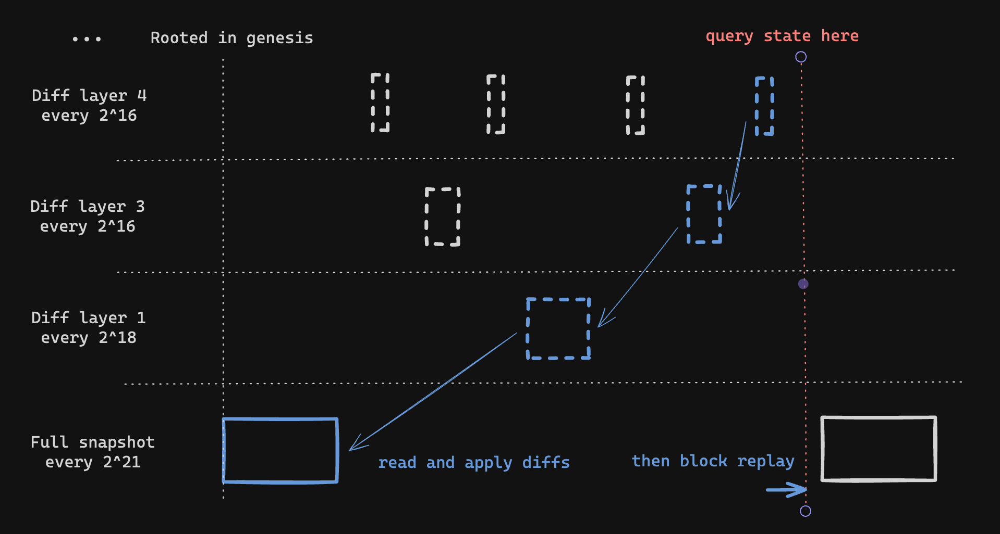

# Database Configuration

Lighthouse uses an efficient "split" database schema, whereby finalized states are stored separately
from recent, unfinalized states. We refer to the portion of the database storing finalized states as
the _freezer_ or _cold DB_, and the portion storing recent states as the _hot DB_.

In both the hot and cold DBs, full `BeaconState` data structures are only stored periodically, and
intermediate states are reconstructed by quickly replaying blocks on top of the nearest state. For
example, to fetch a state at slot 7 the database might fetch a full state from slot 0, and replay
blocks from slots 1-7 while omitting redundant signature checks and Merkle root calculations. In
the freezer DB, Lighthouse also uses hierarchical state diffs to jump larger distances (described in
more detail below).

The full states upon which blocks are replayed are referred to as _snapshots_ in the case of the
freezer DB, and _epoch boundary states_ in the case of the hot DB.

The frequency at which the hot database stores full `BeaconState`s is fixed to one-state-per-epoch
in order to keep loads of recent states performant. For the freezer DB, the frequency is
configurable via the `--hierarchy-exponents` CLI flag, which is the topic of the next section.

## Hierarchical State Diffs

Since v6.0.0, Lighthouse's freezer database uses _hierarchical state diffs_ or _hdiffs_ for short.
These diffs allow Lighthouse to reconstruct any historic state relatively quickly from a very
compact database. The essence of the hdiffs is that full states (snapshots) are stored only around
once per year. To reconstruct a particular state, Lighthouse fetches the last snapshot prior to that
state, and then applies several _layers_ of diffs. For example, to access a state from November
2022, we might fetch the yearly snapshot for the start of 2022, then apply a monthly diff to jump to
November, and then further more granular diffs to reach the particular week, day and epoch desired.
Usually for the last stretch between the start of the epoch and the state requested, some blocks
will be _replayed_.

The following diagram shows part of the layout of diffs in the default configuration. There is a
full snapshot stored every `2^21` slots. In the next layer there are diffs every `2^18` slots which
approximately correspond to "monthly" diffs. Following this are more granular diffs every `2^16`
slots, every `2^13` slots, and so on down to the per-epoch diffs every `2^5` slots.

<-- FIXME(sproul): update this diagram with Lion's sauce -->



The number of layers and frequency of diffs is configurable via the `--hierarchy-exponents` flag,
which has a default value of `5,9,11,13,16,18,21`. The hierarchy exponents must be provided in order
from smallest to largest. The smallest exponent determines the frequency of the "closest" layer
of diffs, with the default value of 5 corresponding to a diff every `2^5` slots (every epoch).
The largest number determines the frequency of full snapshots, with the default value of 21
corresponding to a snapshot every `2^21` slots.

The number of possible `--hierarchy-exponents` configurations is extremely large and our exploration
of possible configurations is still in its relative infancy. If you experiment with non-default
values of `--hierarchy-exponents` we would be interested to hear how it goes. A few rules of thumb
that we have observed are:

- **More frequent snapshots = more space**. This is quite intuitive - if you store full states more
  often then these will take up more space than diffs. However what you lose in space efficiency you
  may gain in speed. It would be possible to achieve a configuration similar to Lighthouse's
  previous `--slots-per-restore-point 32` using `--hierarchy-exponents 5`, although this would use
  _a lot_ of space. It's even possible to push beyond that with `--hierarchy-exponents 0` which
  would store a full state every single slot (NOT RECOMMENDED).
- **Less diff layers are not necessarily faster**. One might expect that the fewer diff layers there
  are, the less work Lighthouse would have to do to reconstruct any particular state. In practise
  this seems to be offset by the increased size of diffs in each layer making the diffs take longer
  to apply. We observed no significant performance benefit from `--hierarchy-exponents 5,7,11`, and
  a substantial increase in space consumed.

If in doubt, we recommend running with the default configuration! It takes a long time to
reconstruct states in any given configuration, so it might be some time before the optimal
configuration is determined.

### CLI Configuration

To configure your Lighthouse node's database, run your beacon node with the `--hierarchy-exponents` flag:

```bash
lighthouse beacon_node --hierarchy-exponents "5,7,11"
```

### Historic state cache

Lighthouse includes a cache to avoid repeatedly replaying blocks when loading historic states. Lighthouse will cache a limited number of reconstructed states and will re-use them when serving requests for subsequent states at higher slots. This greatly reduces the cost of requesting several states in order, and we recommend that applications like block explorers take advantage of this cache.

The historical state cache size can be specified with the flag `--historic-state-cache-size` (default value is 1):

```bash
lighthouse beacon_node --historic-state-cache-size 4
```

> Note: Use a large cache limit can lead to high memory usage.

## Glossary

* _Freezer DB_: part of the database storing finalized states. States are stored in a sparser
  format, and usually less frequently than in the hot DB.
* _Cold DB_: see _Freezer DB_.
* _HDiff_: hierarchical state diff.
* _Hierarchy Exponents_: configuration for hierarchical state diffs, which determines the density
  of stored diffs and snapshots in the freezer DB.
* _Hot DB_: part of the database storing recent states, all blocks, and other runtime data. Full
  states are stored every epoch.
* _Snapshot_: a full `BeaconState` stored periodically in the freezer DB. Yearly by default.
* _Split Slot_: the slot at which states are divided between the hot and the cold DBs. All states
  from slots less than the split slot are in the freezer, while all states with slots greater than
  or equal to the split slot are in the hot DB.
