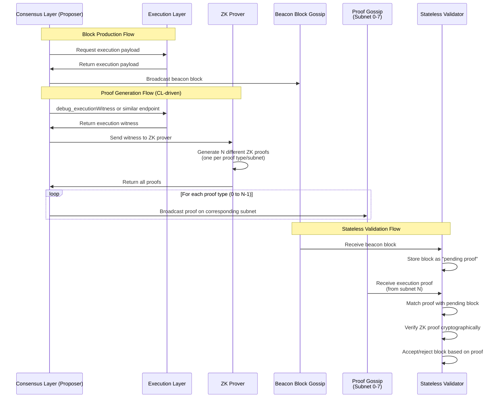

# ZK Stateless Node Integration

This document explains the architecture and implementation of zero-knowledge (ZK) stateless node integration in Lighthouse, including the interaction between the Consensus Layer (CL) and Execution Layer (EL).

## Table of Contents
1. [Primer: CL/EL Architecture](#primer-clel-architecture)
2. [Execution Proofs and ZK Integration](#execution-proofs-and-zk-integration)
3. [Stateless Validation Mode](#stateless-validation-mode)
4. [Implementation Changes](#implementation-changes)
5. [Configuration](#configuration)
6. [Network Architecture](#network-architecture)

## Primer: CL/EL Architecture

### Overview

Ethereum operates with a modular architecture consisting of two main layers:

1. **Consensus Layer (CL)**: Responsible for block consensus, validator management, and the beacon chain
2. **Execution Layer (EL)**: Handles transaction execution, execution layer state management, and the EVM

In some ways, you can view it as being two chains, where the EL chain can only progress when the Consensus Layer explicitly tells it to.

> Both chains store state, however when this document mentions state, it will refer to EL state if not explicitly noted.

  

### Why Stateless Validation?

The traditional Ethereum architecture faces several challenges:

1. **State Growth**: The Ethereum state grows continuously (currently ~200GB+) as new accounts, contracts, and storage are added
2. **Node Accessibility**: Running a full node requires significant disk space, making it inaccessible to many users
3. **Centralization Risk**: As hardware requirements increase, fewer entities can afford to run nodes
4. **Sync Times**: New nodes must either sync from genesis (taking weeks) or use checkpoint sync (still requiring state download)

Stateless validation addresses these issues by:
- Allowing nodes to validate blocks without storing the full state
   - This is because in order to verify a block, you only need a small subset of the state. This subset can arrive with the block; this is the essence of "stateless validation". Ofcourse the state that
   is attached with the block needs to be correct. So a state proof is attached to prove correctness. This state proof is a Merkle Patricia Proof because the state trie is a Merkle Patricia Trie(MPT). 
   Changing the state trie, changes the state proof, verkle is an example of one of these proposed changes.
- Reducing disk requirements from hundreds of GBs to just MBs data
   - This is because state proofs using the MPT are quite large. In the *worse case* they are 300MB at 30Million gas and scale linearly. This is a problem for bandwidth and three ways to address this are to
   change the trie, so that we have more efficient state proofs, address the worse cases or zk stateless.
- Enabling instant sync for new nodes
   - This is because (in the final design) a proof for the block is also a proof for all previous blocks

### What the CL Needs from the EL

The Consensus Layer relies on the Execution Layer for a few functions including:

#### 1. **Payload Execution** (Block Production)

- When **producing** blocks, the CL asks the EL to build an execution payload
- The EL assembles transactions from its mempool, executes them, and returns the payload
- This happens during block proposal when a validator (proposer) need to create new blocks
- This interaction happens through the Engine API (`engine_getPayload`)

#### 2. **EL State Validation** (Block Validation)

- When **validating** blocks (from other validators), the CL needs to verify the execution payload is correct
- This is completely separate from block production - it's about verifying someone else's work
- Traditionally, this requires the EL to maintain the full Ethereum state and re-execute all transactions
- This interaction happens through the Engine API (`engine_newPayload`)

#### 3. **Fork Choice Updates**

- The CL informs the EL about the canonical chain head
- The EL uses this information to organize its own state and handle execution payload reorgs
- This interaction happens through the Engine API (`engine_forkchoiceUpdated`)

### Traditional vs Stateless Architecture

#### Traditional Setup

- **State Storage**: The EL maintains the complete Ethereum state (200GB+ and growing)
- **State Access**: Direct database lookups - "I trust this data because I put it there"
- **Validation Process**: 
  1. Receive block with transactions
  2. Load affected state from local database
  3. Execute transactions against that state
  4. Compute new state root
  5. Verify it matches the block's claimed state root
- **Trust Model**: Self-verifying through re-execution
- **Requirements**: Full/Snap state sync before validation can begin

#### Stateless Architecture (For validators)

- **State Storage**: No state storage required
- **State Access**: Every state access must be accompanied by a cryptographic proof with the execution payload
- **Validation Process**:
  1. Receive block with transactions AND state proof + state
  2. Use state data to re-execute transactions (no full state database needed)
  3. Verify the computed state root matches the block's claimed state root
- **Trust Model**: "I trust this state root because I re-executed using proven state data"

#### Executionless Architecture (For validators)

- **State Storage**: No state storage required
- **State Access**: Not needed - no execution performed
- **Validation Process**:
  1. Receive beacon block with execution payload AND execution proofs (may arrive later via gossip)
  2. Verify the execution proofs (no execution needed)
  3. Accept the state root if proofs are valid
- **Trust Model**: "I trust this state root because the cryptographic proof guarantees it"

> TODO: One confusing thing is that we may have a subnet for state proof, and the other subnets for execution proofs.


### Key Implementation Considerations

When implementing either stateless or executionless validation, several architectural decisions must be made:

#### 1. **Proof Distribution Strategy**
- **Push model Unbundled**: Proofs distributed via dedicated subnets (similar to attestations)
- **Pull mode Unbundled**: Nodes request proofs when needed
- **Bundled**: Proofs included with blocks (increases block size)

#### 2. **Validation Timing**
- **Optimistic Import**: Accept blocks immediately, validate when proofs arrive (This is similar to the pipelining for delayed execution)
- **Pessimistic Import**: Wait for proofs before accepting blocks

#### 3. **Fork Choice Integration**
- **Separate Views**: Keep proven and optimistic chains separate
- **Integrated**: Modify fork choice weights based on proof availability

#### 4. **Resource Management**
- **Number of proofs**: Number of proofs to generate
- **Proof Storage**: How long to keep proofs, storage limits
- **GPU Usage**: Proof generation can be intensive
- **Network Bandwidth**: Proof propagation overhead (300KB per proof)


## Execution Proofs and ZK Integration

Lighthouse implements a sophisticated execution proof system to enable stateless validation. The key components include:

### Execution Proof Messages

Located in `consensus/types/src/execution_proof.rs`, these messages contain:

 

```rust
pub struct ExecutionProof {
    /// The execution block hash this proof attests to
    pub block_hash: ExecutionBlockHash,
    /// The subnet ID where this proof was received/should be sent
    pub subnet_id: ExecutionProofSubnetId,
    /// Version of the proof format
    pub version: u32,
    /// Opaque proof data - structure depends on subnet_id and version
    /// This contains cryptographic proofs from zkVMs or other proof systems
    pub proof_data: Vec<u8>,
    /// Timestamp when this proof was generated (Unix timestamp)
    pub timestamp: u64,
}
```

The proof system supports multiple execution proofs. These are referred to as proof types.

### Proof Distribution

Execution proofs are distributed via gossip subnets to ensure efficient propagation:

1. Proofs are published to specific subnets based on the proof type. For example:
   - Subnet 0: Execution witness proofs
   - Subnet 1: SP1 zkVM proofs
   - Subnet 2: RISC-V zkVM proofs
   - Subnet 3: zkEVM proofs
   - etc. (up to 8 subnets by default)
2. Nodes subscribe to relevant subnets based on their validation needs
3. The broadcaster service manages proof distribution and retries

## Stateless Validation Mode

When `stateless_validation` is enabled in the chain configuration:

### 1. **Proof Reception and Optimistic Import**

- The node subscribes to execution proof subnets automatically
- Incoming proofs are validated and stored in a proof pool
- Optimistic block handling:
  - When a beacon block arrives, it's marked as "optimistic" (since the execution payload cannot be verified without a proof)
  - The block's execution payload hash is registered for proof tracking
  - The node continues processing the block optimistically, assuming it will be valid
  - When matching proofs arrive via gossip, they trigger re-evaluation of pending blocks
  - Beacon blocks transition from optimistic to verified status once enough valid proofs are received
  - The system never rejects blocks due to missing proofs - they remain optimistic until proven valid

> None of this changes the fork choice rules. A beacon block becoming valid, is additional metadata that we store but do not use it to modify fork choice.

### 2. **Block Validation**

- Instead of executing payloads locally, the node waits for execution proofs
- Execution proofs provide cryptographic guarantees of correct execution of the payload
- The validator can therefore validate blocks without maintaining state

### 3. **Dual-View Architecture**

We implement a dual-view architecture for stateless validation that separates consensus from proof validation:

#### Optimistic View (Fork Choice)
- Used by validators for all consensus duties (attestations, proposals, etc.)
- Remains permanently optimistic when `stateless_validation` is enabled (This is akin to the EL always returning SYNCING)
- Fork choice weights are therefore NOT modified by proof availability/correctness
- Allows beacon nodes to participate in consensus without waiting for proofs (or more importantly, it allows us to implement this change without changing fork-choice)

#### Proven View (Proof Store)
- Tracks which blocks have received sufficient execution proofs
- Maintains a "proven canonical chain" from finalized checkpoint to proven head
- Updates independently of fork choice

This separation provides several benefits:

1. **Simplicity**: No complex fork choice modifications needed
2. **Validator Safety**: Validators continue normal operations regardless of proof correctness
3. **Clear Monitoring**: Easy to see the gap between optimistic head and proven head
4. **Future Flexibility**: Can later integrate proven status into fork choice

## Implementation Changes

### Core Components Modified

The Lighthouse implementation adds the following:

1. **Chain Configuration**: New flags for `stateless_validation`, `stateless_min_proofs_required`, and `max_execution_proof_subnets`
2. **Execution Payload Proof Store**: Manages proof storage, validation, and proven chain tracking
3. **Execution Proof Broadcaster**: Background service for broadcasting proofs to gossip subnets
4. **Network Layer**: New gossip topics and subnet management for proof distribution

### Integration Points

1. **Block Import Process**: Blocks are imported optimistically while awaiting proofs
2. **Proof Reception Process**: Incoming proofs trigger re-evaluation of pending beacon blocks
3. **Dual-View Separation**: Fork choice remains optimistic while proven chain tracks validation status wrt proofs

## Configuration

### Node Types

Different node configurations are possible:

1. **Regular Stateful Node** (default):
   ```bash
   lighthouse bn
   ```
   - Maintains full state and validates through execution

2. **Stateless Validator**:
   ```bash
   lighthouse bn --stateless-validation
   ```
   - Validates using execution proofs, no state storage required

3. **Proof Generator Node**:
   ```bash
   lighthouse bn --generate-execution-proofs
   ```
   - Maintains full state and generates proofs for the network

### Configuration Parameters

Key settings include:
- `stateless_validation`: Enable proof-based validation
- `stateless_min_proofs_required`: Minimum proofs needed (default: 1)
- `max_execution_proof_subnets`: Number of proof subnets (default: 8)

## Important Considerations

### Proof Storage Philosophy

- **Store All Valid Proofs**: All valid proofs are stored regardless of whether the block is canonical
- **No Temporal Storage**: proofs are not stored temporarily - they follow the same lifecycle as blocks
- **LRU Eviction**: Simple LRU eviction prevents unbounded growth (default: 10,000 proofs)
- **Finalization-Based Cleanup**: Proofs are pruned based on finalization, similar to block pruning

### Reorg Handling

During chain reorganizations:
- **Proofs Already Available**: Since we store valid proofs for all blocks (not just canonical), proofs are already available when blocks switch from non-canonical to canonical
- **No Re-propagation**: Blocks are not re-gossiped during reorgs, and neither are proofs
- **Automatic Proven Chain Update**: The proven chain automatically adjusts based on the new canonical chain

## Network Architecture

### Proof Propagation Flow



#### Detailed Workflow

**Block Producer/Receiver with Proof Generation:**
1. Maintains full state and can execute transactions
2. When processing any block (produced or received):
   - If `--generate-execution-proofs` is enabled, triggers proof generation
   - Proof generation happens asynchronously in the background
   - Generated proofs are stored in the execution payload proof store
3. The execution proof broadcaster service:
   - Periodically checks for unbroadcast proofs
   - Broadcasts proofs to the appropriate gossip subnets
   - Manages retry logic for failed broadcasts
4. Note: Proof generation is triggered in `notify_new_payload` for all blocks when the flag is set

**Stateless Validator:**
1. Subscribes to relevant proof subnets (based on supported proof types)
2. Receives blocks but cannot validate execution without state
3. Waits for matching execution proofs
4. Validates blocks using cryptographic proofs instead of re-execution
5. Participates in consensus without storing state

### Subnet Distribution

Execution proofs are distributed across multiple subnets to:
1. Prevent network congestion
2. Enable selective subscription (nodes can subscribe only to proof types they support)
3. Improve censorship resistance
4. Separate different proof systems (witness proofs vs various zkVM proofs)

The subnet for a proof is determined by the proof type itself:
- Each proof system (witness, SP1, RISC-V, zkEVM, etc.) has a dedicated subnet
- This allows nodes to subscribe only to proof types they can validate
- The ProofId directly maps to the subnet ID (1:1 mapping)

**Automatic Subnet Subscription:**
- When `--stateless-validation` is enabled, nodes automatically subscribe to ALL execution proof subnets (0-7 by default)
- This ensures stateless nodes can receive proofs from any proof system
- No manual subnet configuration is required for stateless nodes


### Scratch pad

> Rough notes follows


1. **Real Proof Integration**:
   - Implement actual EL witness fetching
   - Integrate with real zkVM proof systems
   - Support for multiple proof formats and versions

2. **Resource Controls**:
   - Add circuit breaker for proof generation with configurable limits
   - Implement task queue with concurrency controls
   - Add metrics for proof generation performance
   - Rate limiting on proof acceptance ( This is essentially where a bad actor floods the network with invalid proofs, or just proofs that do not belong to payloads we will ever care about)

3. **Block Production Support**:
   - Enable stateless nodes to produce blocks via MEV-boost
   - Generate proofs for self-produced blocks

4. **Network Optimizations**:
   - Support request-based proof sharing as fallback

5. **Dummy Proof Generation**: 
   - Currently generates simulated proofs instead of real cryptographic proofs
   - Lacks integration with actual EL witness data (`debug_executionWitness`)
   - Proof data is placeholder content for testing


**Slashing Conditions**: Invalid proofs could result in slashing in the future (depends on if we choose to enshrine the proofs/incentivise it from issuance)
- **Only stateful nodes can generate proofs** - the `--generate-execution-proofs` flag cannot be used with `--stateless-validation`
- Proof generation requires access to the full execution layer state
- Proof generator nodes help the network by creating proofs for all blocks they process (both produced and received)
- Generated proofs are automatically broadcast to the appropriate gossip subnets

**Proof Archival**: Add pluggable archival system for finalized proofs
**Selective Fork Choice Integration**: Optionally allow proven status to influence fork choice