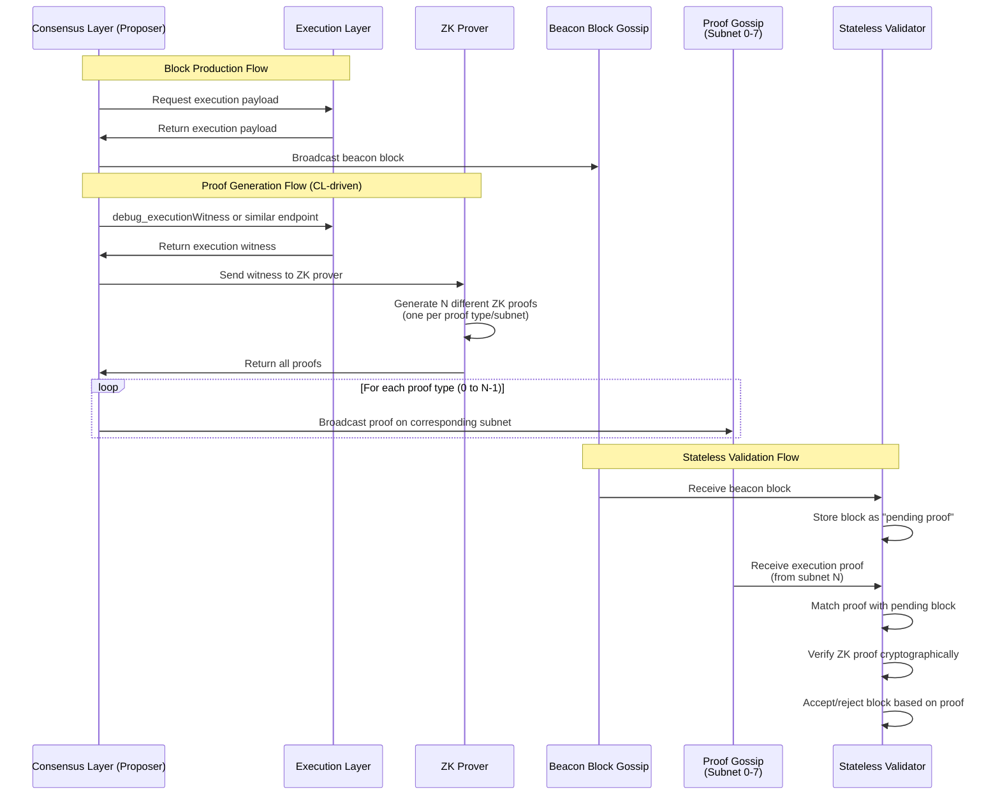

# ZK Stateless Node Integration

This document explains the architecture and implementation of zero-knowledge (ZK) stateless node integration in Lighthouse, including the interaction between the Consensus Layer (CL) and Execution Layer (EL).

## Table of Contents
1. [Primer: CL/EL Architecture](#primer-clel-architecture)
2. [Execution Proofs and ZK Integration](#execution-proofs-and-zk-integration)
3. [Stateless Validation Mode](#stateless-validation-mode)
4. [Implementation Changes](#implementation-changes)
5. [Configuration](#configuration)
6. [Network Architecture](#network-architecture)

## Primer: CL/EL Architecture

### Overview

Ethereum operates with a modular architecture consisting of two main layers:

1. **Consensus Layer (CL)**: Responsible for block consensus, validator management, and the beacon chain
2. **Execution Layer (EL)**: Handles transaction execution, state management, and the EVM

### What the CL Needs from the EL

The Consensus Layer relies on the Execution Layer for several critical functions:

#### 1. **Payload Execution**
- The CL sends execution payloads (blocks) to the EL for processing
- The EL validates transactions, executes them, and returns the resulting state root
- This interaction happens through the Engine API (JSON-RPC interface)

#### 2. **EL State Validation**
- The CL needs to verify that execution payloads produce correct state transitions
- Traditionally, this requires the EL to maintain the full Ethereum state
- The EL provides state roots and receipts roots for validation

#### 3. **Transaction Pool Access**
- When proposing blocks, validators need transactions from the EL's mempool
- The CL requests transaction bundles from the EL to construct execution payloads

#### 4. **Fork Choice Updates**
- The CL informs the EL about the canonical chain head
- The EL uses this information to organize its own state and handle reorgs

### Traditional vs Stateless Architecture

In a traditional setup:
- The EL maintains the complete Ethereum state (hundreds of GBs)
- State access is direct and requires no additional proofs (the proof is due to the fact that the EL inserted the data into the db themselves)
- Every node must sync and store the full state

In a stateless architecture:
- The EL doesn't store the complete state (only a subset of the state is accessed for block validation)
- State access requires cryptographic proofs (witnesses or ZK proofs)
- Nodes can validate blocks without maintaining full state

## Execution Proofs and ZK Integration

Lighthouse implements a sophisticated execution proof system to enable stateless validation. The key components include:

### Execution Proof Messages

Located in `consensus/types/src/execution_proof.rs`, these messages contain:

```rust
pub struct ExecutionProof {
    /// The execution block hash this proof attests to
    pub block_hash: ExecutionBlockHash,
    /// The subnet ID where this proof was received/should be sent
    pub subnet_id: ExecutionProofSubnetId,
    /// Version of the proof format
    pub version: u32,
    /// Opaque proof data - structure depends on subnet_id and version
    /// This contains cryptographic proofs from zkVMs or other proof systems
    pub proof_data: Vec<u8>,
    /// Timestamp when this proof was generated (Unix timestamp)
    pub timestamp: u64,
}
```

The proof system supports multiple proof types:
- **Witness Proofs**: Traditional Merkle proofs for state access
- **Custom Proofs**: ZK proofs from zkVMs or other proof systems

### Proof Distribution

Execution proofs are distributed via gossip subnets to ensure efficient propagation:

1. Proofs are published to specific subnets based on the proof type
   - Subnet 0: Execution witness proofs
   - Subnet 1: SP1 zkVM proofs
   - Subnet 2: RISC-V zkVM proofs
   - Subnet 3: zkEVM proofs
   - etc. (up to 8 subnets by default)
2. Nodes subscribe to relevant subnets based on their validation needs
3. The broadcaster service manages proof distribution and retries

## Stateless Validation Mode

When `stateless_validation` is enabled in the chain configuration:

### 1. **Proof Reception and Optimistic Import**
- The node subscribes to execution proof subnets automatically
- Incoming proofs are validated and stored in a proof pool
- Optimistic block handling:
  - When a block arrives without proofs, it's marked as "optimistic" (pending validation)
  - The block's execution payload hash is registered for proof tracking
  - The node continues processing the block optimistically, assuming it will be valid
  - When matching proofs arrive via gossip, they trigger re-evaluation of pending blocks
  - Blocks transition from optimistic to verified status once valid proofs are received
  - The system never rejects blocks due to missing proofs - they remain optimistic until proven valid
  - A background service cleans up old pending blocks after a certain period

### 2. **Block Validation**
- Instead of executing payloads locally, the node waits for execution proofs
- ZK proofs provide cryptographic guarantees of correct execution
- The node can validate blocks without maintaining state

### 3. **Resource Efficiency**
- Dramatically reduced disk usage (no state storage on the EL)
- Lower CPU requirements (no transaction execution)
- Faster sync times (no state download)

### 4. **Dual-View Architecture**

Lighthouse implements a dual-view architecture for stateless validation that separates consensus participation from proof validation:

#### Optimistic View (Fork Choice)
- Used by validators for all consensus duties (attestations, proposals, etc.)
- Remains permanently optimistic when `stateless_validation` is enabled
- Fork choice weights are NOT modified by proof availability
- Allows validators to participate in consensus without waiting for proofs

#### Proven View (Proof Store)
- Tracks which blocks have received sufficient execution proofs
- Maintains a "proven canonical chain" from finalized checkpoint to proven head
- Updates independently of fork choice
- Used for monitoring, metrics, and future archival purposes

This separation provides several benefits:
1. **Simplicity**: No complex fork choice modifications needed
2. **Validator Safety**: Validators continue normal operations regardless of proof availability
3. **Clear Monitoring**: Easy to see the gap between optimistic head and proven head
4. **Future Flexibility**: Can later integrate proven status into fork choice if desired

### 5. **Proven Chain Tracking**

The execution payload proof store maintains detailed information about the proven chain:

```rust
pub struct ProvenBlockInfo {
    pub beacon_block_root: Hash256,
    pub execution_block_hash: ExecutionBlockHash,
    pub slot: Slot,
    pub parent_root: Hash256,
    pub proof_count: usize,
    pub proven_at: Instant,
}
```

Key features:
- **Proven Head**: The deepest block in the canonical chain with sufficient proofs
- **Proven Chain Walk**: Walks backwards from optimistic head to find longest proven chain
- **Proof Sufficiency**: Configurable minimum proof count (default: 1)
- **Metrics**: Track lag between optimistic and proven heads

## Implementation Changes

### Core Components Modified

#### 1. **Chain Configuration** (`beacon_chain/src/chain_config.rs`)
```rust
pub struct ChainConfig {
    pub stateless_validation: bool,
    pub stateless_min_proofs_required: usize,  // Minimum proofs for block to be considered proven
    pub max_execution_proof_subnets: u64,       // Number of proof subnets to subscribe to
    // ...
}
```

#### 2. **Execution Payload Proof Store** (`beacon_chain/src/execution_payload_proofs.rs`)
Enhanced with dual-view tracking:
```rust
pub struct ExecutionPayloadProofStore {
    // Original proof storage
    proofs: Arc<RwLock<HashMap<(ExecutionBlockHash, ProofId), ExecutionPayloadProof>>>,
    pending_blocks: Arc<RwLock<HashMap<ExecutionBlockHash, Vec<Hash256>>>>,
    
    // New proven chain tracking
    proven_canonical_chain: Arc<RwLock<HashMap<Hash256, ProvenBlockInfo>>>,
    proven_head: Arc<RwLock<Option<(Hash256, Slot)>>>,
    proven_finalized: Arc<RwLock<Option<(Hash256, Slot)>>>,
}
```

Key methods:
- `update_proven_chain()`: Walks from optimistic head to find longest proven chain
- `get_proven_head()`: Returns current proven head
- `is_block_proven()`: Checks if a block has sufficient proofs

#### 3. **Beacon Chain Re-evaluation** (`beacon_chain/src/beacon_chain.rs`)
Modified `re_evaluate_optimistic_blocks_with_proofs()`:
- No longer modifies fork choice weights
- Updates proven chain tracking instead
- Never triggers head recomputation
- Fork choice remains permanently optimistic

#### 4. **Network Layer**
- New gossip topics for execution proofs
- Subnet management for proof distribution (up to 8 subnets by default)
- Automatic subscription to all proof subnets in stateless mode

### Integration Points

#### 1. **Block Import Process**
When a new block arrives in stateless mode:
1. Block is imported optimistically (marked as pending proof validation)
2. Execution payload hash is registered for proof tracking
3. Fork choice includes the block immediately (optimistic view)
4. Block remains in optimistic state until proofs arrive

#### 2. **Proof Reception Process**
When execution proofs arrive via gossip:
1. Proofs are validated and stored in the proof store
2. `update_proven_chain()` is called to recompute the proven chain
3. Proven head may advance if sufficient proofs now exist
4. Fork choice is NOT modified (remains optimistic)

#### 3. **Dual-View Separation**
- **Fork Choice**: Always optimistic, used for validator duties
- **Proven Chain**: Tracks validation status, used for monitoring
- No cross-contamination between the two views
- Validators can attest/propose regardless of proof status

## Important Considerations

### Proof Storage Philosophy

- **Store All Valid Proofs**: All valid proofs are stored regardless of whether the block is canonical
- **No Temporal Storage**: proofs are not stored temporarily - they follow the same lifecycle as blocks
- **LRU Eviction**: Simple LRU eviction prevents unbounded growth (default: 10,000 proofs)
- **Finalization-Based Cleanup**: Proofs are pruned based on finalization, similar to block pruning

### Reorg Handling

During chain reorganizations:
- **Proofs Already Available**: Since we store proofs for all blocks (not just canonical), proofs are already available when blocks switch from non-canonical to canonical
- **No Re-propagation**: Blocks are not re-gossiped during reorgs, and neither are proofs
- **Automatic Proven Chain Update**: The proven chain automatically adjusts based on the new canonical chain

### Future Enhancements

Potential improvements to the current design:
1. **Proof Archival**: Add pluggable archival system for finalized proofs
2. **Proof Aggregation**: Support for aggregated proofs that validate multiple blocks
3. **Selective Fork Choice Integration**: Optionally allow proven status to influence fork choice
4. **Cross-Proof Validation**: Verify consistency between different proof types

## Configuration

### Enabling Stateless Validation

To run a stateless validator node:

```bash
lighthouse bn --stateless-validation
```

This enables the node to:
- Subscribe to all execution proof subnets automatically
- Accept blocks optimistically while waiting for proofs
- Validate blocks using cryptographic proofs instead of re-execution
- Operate without requiring a full execution layer state

### Proof Generation

Some nodes can be configured to generate proofs for the network. This is done with a separate flag:

```bash
lighthouse bn --generate-execution-proofs
```

**Important Notes:**
- **Only stateful nodes can generate proofs** - the `--generate-execution-proofs` flag cannot be used with `--stateless-validation`
- Proof generation requires access to the full execution layer state
- Proof generator nodes help the network by creating proofs for all blocks they process (both produced and received)
- Generated proofs are automatically broadcast to the appropriate gossip subnets

### Node Types

With these flags, you can configure different types of nodes:

1. **Regular Stateful Node** (default)
   ```bash
   lighthouse bn
   ```
   - Maintains full state
   - Validates blocks through execution
   - Traditional operation

2. **Stateless Validator**
   ```bash
   lighthouse bn --stateless-validation
   ```
   - No state storage required
   - Consumes proofs from the network
   - Cannot generate proofs
   - Validates blocks using cryptographic proofs

3. **Proof Generator Node**
   ```bash
   lighthouse bn --generate-execution-proofs
   ```
   - Maintains full state
   - Generates proofs for all blocks
   - Helps stateless nodes by providing proofs
   - Can also validate blocks normally

### Configuration Options

Key configuration parameters:

```yaml
# Enable stateless validation mode
stateless_validation: true

# Generate execution proofs (only for stateful nodes)
generate_execution_proofs: false

# Maximum number of execution proofs to cache
max_execution_payload_proofs: 10000

# Maximum number of execution proof subnets (default: 8)
max_execution_proof_subnets: 8

# Minimum number of proofs required to consider a block proven (default: 1)
stateless_min_proofs_required: 1
```

### Command Line Options

```bash
# Run a stateless validator with custom proof requirements
lighthouse bn --stateless-validation --stateless-min-proofs-required 2

# Run a proof generator node
lighthouse bn --generate-execution-proofs
```

### Performance Tuning

Key parameters to consider:

1. **Proof Pool Size**: Balance memory usage vs proof availability (`max_execution_payload_proofs`)
2. **Subnet Count**: More subnets = better load distribution (`max_execution_proof_subnets`)
3. **Proof Requirements**: Higher `stateless_min_proofs_required` = more security but higher latency
4. **Resource Limits**: Currently lacks circuit breaker for proof generation (see TODOs in code) (maybe remove this since not important right now)

## Network Architecture

### Proof Propagation Flow



#### Detailed Workflow

**Block Producer/Receiver with Proof Generation:**
1. Maintains full state and can execute transactions
2. When processing any block (produced or received):
   - If `--generate-execution-proofs` is enabled, triggers proof generation
   - Proof generation happens asynchronously in the background
   - Generated proofs are stored in the execution payload proof store
3. The execution proof broadcaster service:
   - Periodically checks for unbroadcast proofs
   - Broadcasts proofs to the appropriate gossip subnets
   - Manages retry logic for failed broadcasts
4. Note: Proof generation is triggered in `notify_new_payload` for all blocks when the flag is set

**Stateless Validator:**
1. Subscribes to relevant proof subnets (based on supported proof types)
2. Receives blocks but cannot validate execution without state
3. Waits for matching execution proofs
4. Validates blocks using cryptographic proofs instead of re-execution
5. Participates in consensus without storing state

### Subnet Distribution

Execution proofs are distributed across multiple subnets to:
1. Prevent network congestion
2. Enable selective subscription (nodes can subscribe only to proof types they support)
3. Improve censorship resistance
4. Separate different proof systems (witness proofs vs various zkVM proofs)

The subnet for a proof is determined by the proof type itself:
- Each proof system (witness, SP1, RISC-V, zkEVM, etc.) has a dedicated subnet
- This allows nodes to subscribe only to proof types they can validate
- The ProofId directly maps to the subnet ID (1:1 mapping)

**Automatic Subnet Subscription:**
- When `--stateless-validation` is enabled, nodes automatically subscribe to ALL execution proof subnets (0-7 by default)
- This ensures stateless nodes can receive proofs from any proof system
- No manual subnet configuration is required for stateless nodes

### Security Considerations

1. **Proof Validity**: All proofs must be cryptographically verified
2. **DoS Protection**: Rate limiting on proof acceptance ( This is essentially where a bad actor floods the network with invalid proofs, or just proofs that do not belong to payloads we will ever care about)
3. **Slashing Conditions**: Invalid proof signatures could result in slashing in the future (depends on if we choose to enshrine the proofs/incentivise it from issuance)

## Practical Examples

### Running a Test Network

To test stateless validation with Kurtosis:

```yaml
# network_params.yaml
participants:
  # Stateful proof generator nodes
  - el_type: geth
    cl_type: lighthouse
    cl_extra_params:
      - --generate-execution-proofs
    count: 2
  
  # Stateless validator nodes
  - el_type: geth
    cl_type: lighthouse
    cl_extra_params:
      - --stateless-validation
    count: 2
  
  # Regular nodes
  - el_type: geth
    cl_type: lighthouse
    count: 1
```

### Monitoring Stateless Operation

Key log messages to watch for:

1. **Proof Generation** (on proof generator nodes):
   ```
   INFO Triggering proof generation for execution payload 0x...
   DEBUG PROOFCHAIN 0x...: Spawning proof generation task (block #123)
   DEBUG PROOFCHAIN 0x...: Generated execution_witness_v1 on subnet 0
   ```

2. **Optimistic Import** (on stateless nodes):
   ```
   INFO STATELESS: Block entering PENDING state - Found 0/1 required proofs
   INFO STATELESS: Registered optimistic block as PENDING execution proof validation
   INFO STATELESS_TRACE: Block registered - beacon_root: 0x..., exec_hash: 0x... -> PENDING proof
   ```

3. **Proven Chain Updates** (on stateless nodes):
   ```
   INFO PROOFCHAIN 0x...: minimum proofs reached (1/1), updating proven chain
   INFO PROOFCHAIN STATUS: Proven slot 123 | Optimistic slot 128 | Lag 5 slots | Status: Catching up
   INFO PROOFCHAIN SUMMARY:
     Proven head: slot 123 (epoch 3)
     Proven chain depth: 45 blocks
     Optimistic head: slot 128 (epoch 4)
     Proof generation lag: 5 slots
   ```

4. **Network Activity**:
   ```
   INFO Subscribed to ExecutionProof subnets: [0, 1, 2, 3, 4, 5, 6, 7]
   INFO STATELESS: Successfully BROADCAST execution proof for block 0x... on subnet 0
   INFO Processing gossip execution proof (from subnet 0)
   ```

### Future API Endpoints

The dual-view architecture enables new monitoring endpoints (planned):

1. **Proven Chain Status**:
   ```
   GET /eth/v1/beacon/proven_head
   GET /eth/v1/beacon/proven_chain
   GET /eth/v1/debug/proven_chain_status
   ```

2. **Key Metrics**:
   - `proven_chain_depth`: Number of blocks in proven chain
   - `proven_chain_lag_slots`: Difference between optimistic and proven heads
   - `blocks_awaiting_proofs`: Count of optimistic blocks without proofs

### Design Rationale

The dual-view architecture was chosen for several reasons:

1. **Simplicity**: Avoids complex modifications to the fork choice algorithm
2. **Safety**: Validators continue normal operations even if proofs are delayed
3. **Flexibility**: Allows experimentation with different proof requirements
4. **Migration Path**: Easier transition from current optimistic sync
5. **Monitoring**: Clear visibility into proof validation status

This design allows the network to experiment with stateless validation while maintaining validator safety and network stability.

## Current Limitations and Known Issues

### Implementation Status

The current implementation is a prototype with several limitations:

1. **Dummy Proof Generation**: 
   - Currently generates simulated proofs instead of real cryptographic proofs
   - Lacks integration with actual EL witness data (`debug_executionWitness`)
   - Proof data is placeholder content for testing

2. **Block Production Limitations**:
   - Stateless nodes cannot produce blocks (returns error)
   - No integration with MEV-boost for stateless block production
   - Proof generation only happens for received blocks, not produced blocks

3. **Resource Management**:
   - **No circuit breaker for proof generation** - system could be overwhelmed during high load
   - Lacks concurrent task limits for proof generation
   - No CPU/memory monitoring or backpressure handling
   - Missing timeout mechanisms for runaway proof tasks

4. **Proof Generation Timing**:
   - Hardcoded delays for simulating proof generation (1-3 seconds base + staggered subnet delays)
   - No prioritization of important blocks
   - Sequential proof generation for multiple subnets

### Future Work

To make this production-ready, the following enhancements are needed:

1. **Real Proof Integration**:
   - Implement actual EL witness fetching
   - Integrate with real zkVM proof systems
   - Support for multiple proof formats and versions

2. **Resource Controls**:
   - Add circuit breaker with configurable limits
   - Implement task queue with concurrency controls
   - Add metrics for proof generation performance

3. **Block Production Support**:
   - Enable stateless nodes to produce blocks via MEV-boost
   - Generate proofs for self-produced blocks
   - Optimize proof generation timing for block proposals

4. **Network Optimizations**:
   - Implement proof pre-fetching for anticipated blocks
   - Add proof bundling to reduce network overhead
   - Support request-based proof sharing as fallback