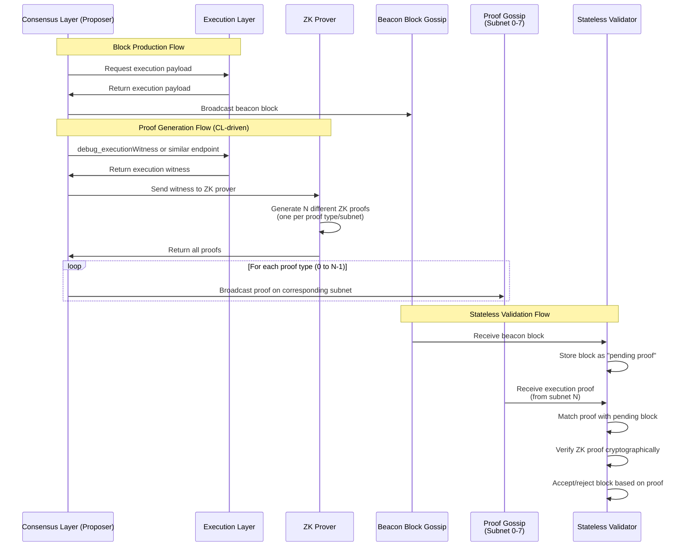

# ZK Stateless Node Integration

This document explains the architecture and implementation of zero-knowledge (ZK) stateless node integration in Lighthouse, including the interaction between the Consensus Layer (CL) and Execution Layer (EL).

## Table of Contents
1. [Primer: CL/EL Architecture](#primer-clel-architecture)
2. [Execution Proofs and ZK Integration](#execution-proofs-and-zk-integration)
3. [Stateless Validation Mode](#stateless-validation-mode)
4. [Implementation Changes](#implementation-changes)
5. [Configuration](#configuration)
6. [Network Architecture](#network-architecture)

## Primer: CL/EL Architecture

### Overview

Ethereum operates with a modular architecture consisting of two main layers:

1. **Consensus Layer (CL)**: Responsible for block consensus, validator management, and the beacon chain
2. **Execution Layer (EL)**: Handles transaction execution, state management, and the EVM

### What the CL Needs from the EL

The Consensus Layer relies on the Execution Layer for several critical functions:

#### 1. **Payload Execution**
- The CL sends execution payloads (blocks) to the EL for processing
- The EL validates transactions, executes them, and returns the resulting state root
- This interaction happens through the Engine API (JSON-RPC interface)

#### 2. **State Validation**
- The CL needs to verify that execution payloads produce correct state transitions
- Traditionally, this requires the EL to maintain the full Ethereum state
- The EL provides state roots and receipts roots for validation

#### 3. **Transaction Pool Access**
- When proposing blocks, validators need transactions from the EL's mempool
- The CL requests transaction bundles from the EL to construct execution payloads

#### 4. **Fork Choice Updates**
- The CL informs the EL about the canonical chain head
- The EL uses this information to organize its own state and handle reorgs

### Traditional vs Stateless Architecture

In a traditional setup:
- The EL maintains the complete Ethereum state (hundreds of GBs)
- State access is direct and requires no additional proofs (the proof is due to the fact that the EL inserted the data into the db themselves)
- Every node must sync and store the full state

In a stateless architecture:
- The EL doesn't store the complete state (only a subset of the state is accessed for block validation)
- State access requires cryptographic proofs (witnesses or ZK proofs)
- Nodes can validate blocks without maintaining full state

## Execution Proofs and ZK Integration

Lighthouse implements a sophisticated execution proof system to enable stateless validation. The key components include:

### Execution Proof Messages

Located in `consensus/types/src/execution_proof.rs`, these messages contain:

```rust
pub struct ExecutionProof {
    /// The execution block hash this proof attests to
    pub block_hash: ExecutionBlockHash,
    /// The subnet ID where this proof was received/should be sent
    pub subnet_id: ExecutionProofSubnetId,
    /// Version of the proof format
    pub version: u32,
    /// Opaque proof data - structure depends on subnet_id and version
    /// This contains cryptographic proofs from zkVMs or other proof systems
    pub proof_data: Vec<u8>,
    /// Timestamp when this proof was generated (Unix timestamp)
    pub timestamp: u64,
}
```

The proof system supports multiple proof types:
- **Witness Proofs**: Traditional Merkle proofs for state access
- **Custom Proofs**: ZK proofs from zkVMs or other proof systems

### Proof Distribution

Execution proofs are distributed via gossip subnets to ensure efficient propagation:

1. Proofs are published to specific subnets based on the proof type
   - Subnet 0: Execution witness proofs
   - Subnet 1: SP1 zkVM proofs
   - Subnet 2: RISC-V zkVM proofs
   - Subnet 3: zkEVM proofs
   - etc. (up to 8 subnets by default)
2. Nodes subscribe to relevant subnets based on their validation needs
3. The broadcaster service manages proof distribution and retries

## Stateless Validation Mode

When `stateless_validation` is enabled in the chain configuration:

### 1. **Proof Reception**
- The node subscribes to execution proof subnets
- Incoming proofs are validated and stored in a proof pool
- Proofs are matched with pending block validations:
  - When a block arrives before its proof, it enters a "pending validation" state
  - The block's execution payload hash is used as a key to await matching proofs
  - Once a proof with matching execution block hash arrives, validation can proceed
  - The system follows an optimistic approach - blocks are not rejected due to missing proofs
  - Instead, blocks without proofs are tracked until finalization, when old pending blocks are cleaned up

### 2. **Block Validation**
- Instead of executing payloads locally, the node waits for execution proofs
- ZK proofs provide cryptographic guarantees of correct execution
- The node can validate blocks without maintaining state

### 3. **Resource Efficiency**
- Dramatically reduced disk usage (no state storage on the EL)
- Lower CPU requirements (no transaction execution)
- Faster sync times (no state download)

## Implementation Changes

### Core Components Modified

#### 1. **Chain Configuration** (`beacon_chain/src/chain_config.rs`)
```rust
pub struct ChainConfig {
    pub stateless_validation: bool,
    pub max_execution_payload_proofs: usize,
    pub execution_proof_subnets: Vec<u64>,
    // ...
}
```

#### 2. **Execution Proof Broadcaster** (`client/src/execution_proof_broadcaster.rs`)
- Background service for proof distribution
- Manages proof availability and broadcast timing
- Handles retry logic for failed broadcasts

#### 3. **Network Layer**
- New gossip topics for execution proofs
- Subnet management for proof distribution
- Peer discovery optimizations for proof exchange

### Integration Points

#### 1. **Block Import Process**
When a new block arrives:
1. If stateless validation is disabled: Execute normally via EL
2. If stateless validation is enabled: Wait for execution proof
3. Validate proof cryptographically
4. Accept or reject block based on proof validity

#### 2. **Proof Pool Management**
- Maintains a bounded pool of execution proofs
- Implements proof eviction policies
- Handles proof request/response protocols

#### 3. **Fork Choice Integration**
- Execution proofs influence fork choice weight
- Blocks without valid proofs are not considered canonical for stateless nodes (they optimistically follow )
- Proof availability affects block finalization for stateless nodes

## Configuration

### Enabling Stateless Validation

In your beacon node configuration:

```yaml
# Enable stateless validation mode
stateless_validation: true

# Maximum number of execution proofs to cache
max_execution_payload_proofs: 1024

# Subnet configuration for proof reception
execution_proof_subnets: [0, 1, 2, 3]
max_execution_proof_subnets: 4
```

### Performance Tuning

Key parameters to consider:

1. **Proof Pool Size**: Balance memory usage vs proof availability
2. **Subnet Count**: More subnets = better load distribution
3. **Proof Timeout**: How long to wait for proofs before rejecting blocks

## Network Architecture

### Proof Propagation Flow



#### Detailed Workflow

**Block Proposer (Full Node):**
1. Maintains full state and can execute transactions
2. Produces blocks normally through the EL
3. After block production, the CL:
   - Requests execution witness from EL (via `debug_executionWitness` or similar)
   - Sends witness to ZK prover for proof generation
   - Note: The CL can obtain witnesses from any source, not just its own EL
4. Broadcasts both the block and its proof to the network

**Stateless Validator:**
1. Subscribes to relevant proof subnets (based on supported proof types)
2. Receives blocks but cannot validate execution without state
3. Waits for matching execution proofs
4. Validates blocks using cryptographic proofs instead of re-execution
5. Participates in consensus without storing state

### Subnet Distribution

Execution proofs are distributed across multiple subnets to:
1. Prevent network congestion
2. Enable selective subscription (nodes can subscribe only to proof types they support)
3. Improve censorship resistance
4. Separate different proof systems (witness proofs vs various zkVM proofs)

The subnet for a proof is determined by the proof type itself:
- Each proof system (witness, SP1, RISC-V, zkEVM, etc.) has a dedicated subnet
- This allows nodes to subscribe only to proof types they can validate
- The ProofId directly maps to the subnet ID (1:1 mapping)

### Security Considerations

1. **Proof Validity**: All proofs must be cryptographically verified
2. **DoS Protection**: Rate limiting on proof acceptance ( This is essentially where a bad actor floods the network with invalid proofs, or just proofs that do not belong to payloads we will ever care about)
3. **Slashing Conditions**: Invalid proof signatures could result in slashing in the future (depends on if we choose to enshrine the proofs/incentivise it from issuance)