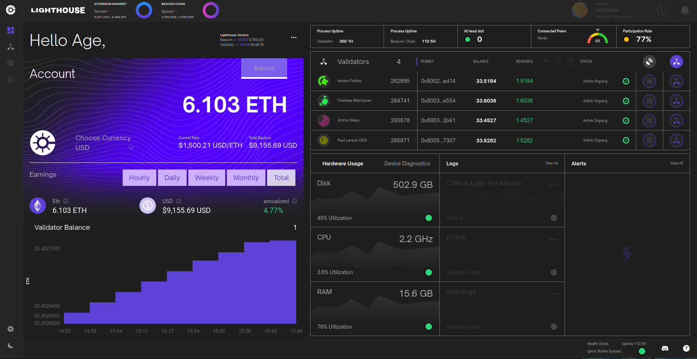

# Lighthouse UI (Siren)

_Documentation for Siren users and developers._

[![Chat Badge]][Chat Link]

[Chat Badge]: https://img.shields.io/badge/chat-discord-%237289da
[Chat Link]: https://discord.gg/cyAszAh

Siren is a user interface built for Lighthouse that connects to a Lighthouse Beacon Node and
a Lighthouse Validator Client to monitor performance and display key validator
metrics.

The UI is currently in active development. Its resides in the
[Siren](https://github.com/sigp/siren) repository.

## Topics

See the following Siren specific topics for more context-specific
information:

- [Installation Guide](./ui-installation.md) - Information to install and run the Lighthouse UI.
- [Configuration Guide](./ui-configuration.md) - Explanation of how to setup
	and configure Siren.
- [Authentication Guide](./ui-authentication.md) - Explanation of how Siren authentication works and protects validator actions.
- [Usage](./ui-usage.md) - Details various Siren components.
- [FAQs](./ui-faqs.md) - Frequently Asked Questions.

## Contributing

If you find and issue or bug or would otherwise like to help out with the
development of the Siren project, please submit issues and PRs to the [Siren](https://github.com/sigp/siren) repository.
