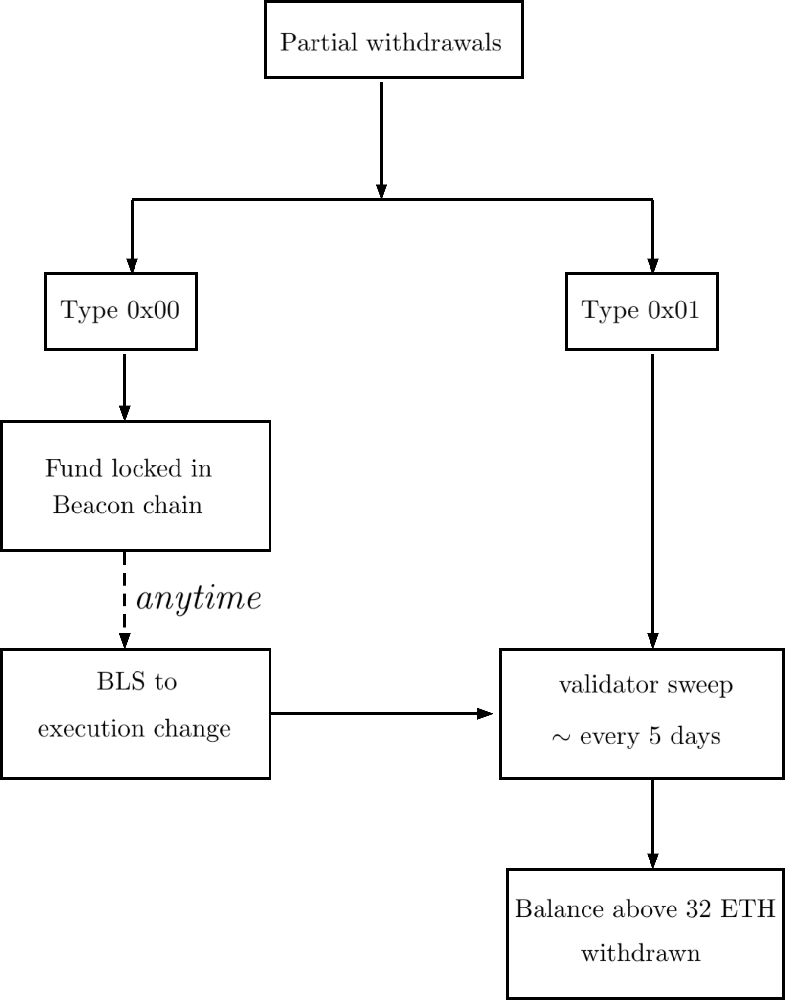

# Partial Withdrawals

After the [Capella](https://ethereum.org/en/history/#capella) upgrade on 12th April 2023:

 - if a validator has a withdrawal credential type `0x00`, the rewards will continue to accumulate and will be locked in the beacon chain.
 - if a validator has a withdrawal credential type `0x01`, any rewards above 32ETH will be periodically withdrawn to the withdrawal address. This is also known as the "validator sweep", i.e., once the "validator sweep" reaches your validator's index, your rewards will be withdrawn to the withdrawal address.  At the time of writing, with 560,000+ validators on the Ethereum mainnet, you shall expect to receive the rewards approximately every 5 days.

### FAQ
1. How to know if I have the withdrawal credentials type `0x00` or `0x01`?
   
   Refer [here](./voluntary-exit.md#1-how-to-know-if-i-have-the-withdrawal-credentials-type-0x01).

2. My validator has withdrawal credentials type `0x00`, is there a deadline to update my withdrawal credentials?

   No.  You can update your withdrawal credentials **anytime**. The catch is that as long as you do not update your withdrawal credentials, your rewards in the beacon chain will continue to be locked in the beacon chain. Only after you update the withdrawal credentials, will the rewards be withdrawn to the withdrawal address.

3. Do I have to do anything to get my rewards after I update the withdrawal credentials to type `0x01`?

    No. The "validator sweep" occurs automatically and you can expect to receive the rewards every few days. 

    Figure below summarizes partial withdrawals.

    