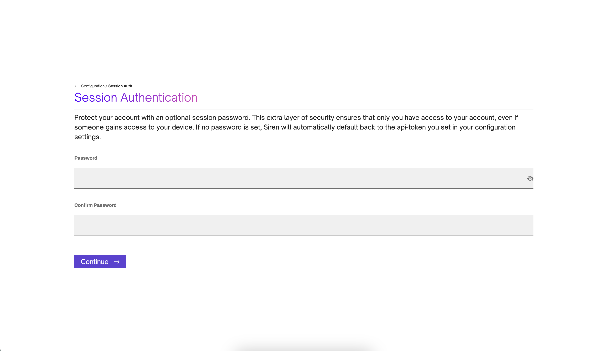
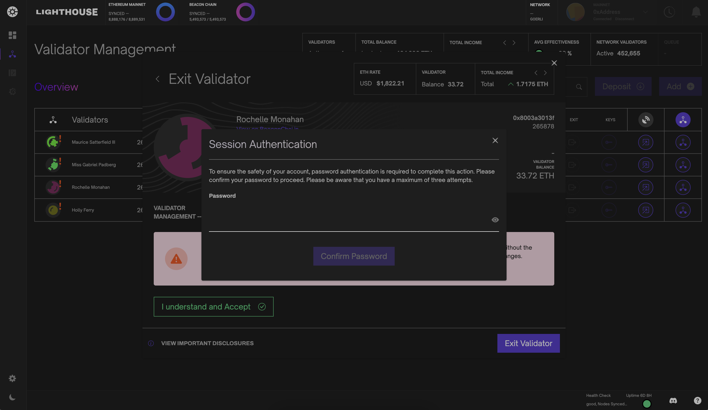
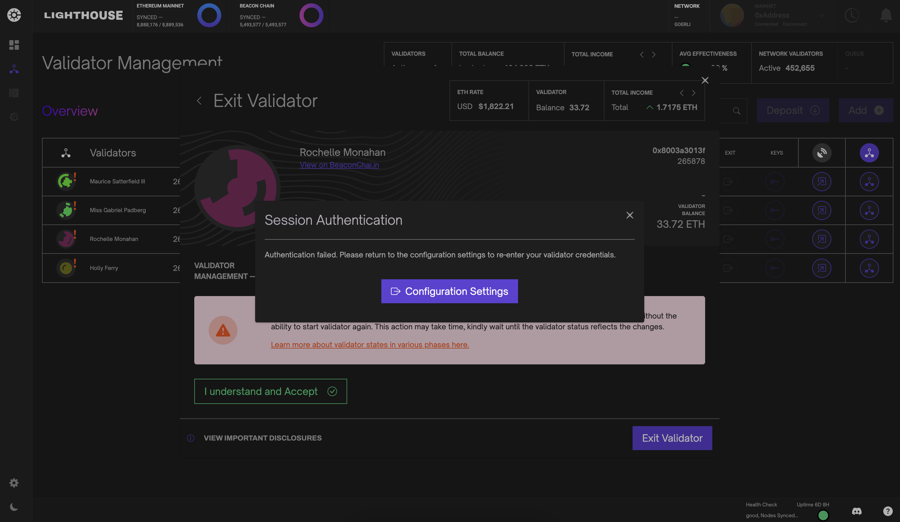
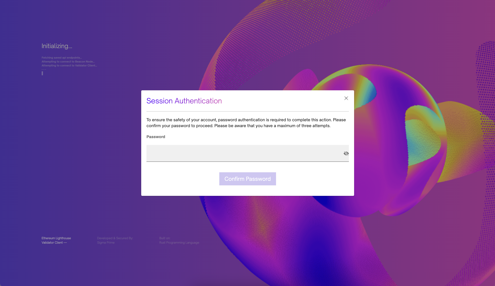

# Authentication

To enhance the security of your account, we offer the option to set a session password. This allows the user to avoid re-entering the api-token when performing critical mutating operations on the validator. Instead a user can simply enter their session password. In the absence of a session password, Siren will revert to the api-token specified in your configuration settings as the default security measure.

> This does not protect your validators from unauthorized device access. 

Session passwords must contain at least:

- 12 characters
- 1 lowercase letter
- 1 uppercase letter
- 1 number
- 1 special character

## Protected Actions

Prior to executing any sensitive validator action, Siren will request authentication of the session password or api-token.

In the event of three consecutive failed attempts, Siren will initiate a security measure by locking all actions and prompting for configuration settings to be renewed to regain access to these features.

## Auto Connect

In the event that auto-connect is enabled, refreshing the Siren application will result in a prompt to authenticate the session password or api-token. If three consecutive authentication attempts fail, Siren will activate a security measure by locking the session and prompting for configuration settings to be reset to regain access.

