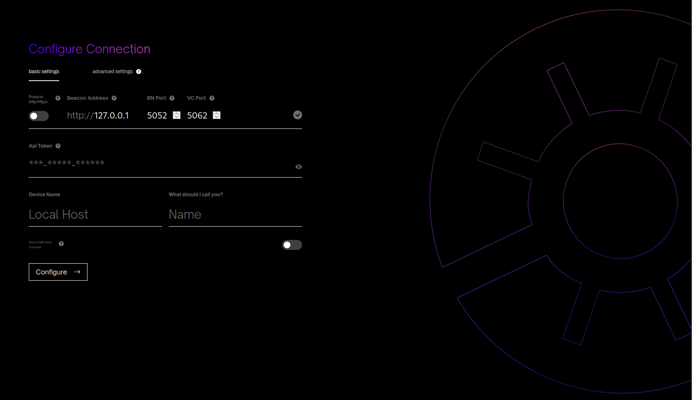

# Configuration

Siren requires a connection to both a Lighthouse Validator Client
and a Lighthouse Beacon Node. Upon running you will first be greeted by the
following configuration screen.

## Connecting to the Clients

Both the Beacon node and the Validator client need to have their HTTP APIs enabled. These ports should be accessible from the computer running Siren. This allows you to enter the address and ports of the associated Lighthouse
Beacon node and Lighthouse Validator client.

To enable the HTTP API for the beacon node, utilize the `--gui` CLI flag. This action ensures that the HTTP API can be accessed by other software on the same machine.

> The Beacon Node must be run with the `--gui` flag set.

If you require accessibility from another machine within the network, configure the `--http-address` to match the local LAN IP of the system running the Beacon Node and Validator Client.

> To access from another machine on the same network (192.168.0.200) set the Beacon Node and Validator Client `--http-address` as `192.168.0.200`.

In a similar manner, the validator client requires activation of the `--http` flag, along with the optional consideration of configuring the `--http-address` flag. If `--http-address` flag is set on the Validator Client, then the `--unencrypted-http-transport` flag is required as well. These settings will ensure compatibility with Siren's connectivity requirements.

If you run Siren in the browser (by entering `localhost` in the browser), you will need to allow CORS in the HTTP API. This can be done by adding the flag `--http-allow-origin "*"` for both beacon node and validator client.

A green tick will appear once Siren is able to connect to both clients. You
can specify different ports for each client by clicking on the advanced tab.

## API Token

The API Token is a secret key that allows you to connect to the validator
client. The validator client's HTTP API is guarded by this key because it
contains sensitive validator information and the ability to modify
validators. Please see [`Validator Authorization`](./api-vc-auth-header.md)
for further details.

Siren requires this token in order to connect to the Validator client.
The token is located in the default data directory of the validator
client. The default path is
`~/.lighthouse/<network>/validators/api-token.txt`.

The contents of this file for the desired validator client needs to be
entered.

## Name

This is your name, it can be modified and is solely used for aesthetics.

## Device

This is a name that can be associated with the validator client/beacon
node pair. Multiple such pairs can be remembered for quick swapping between
them.
