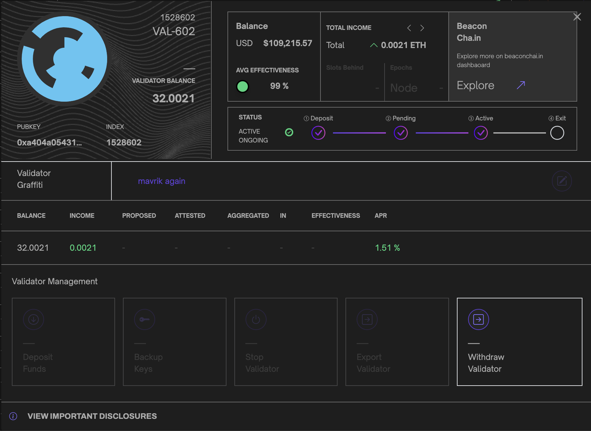
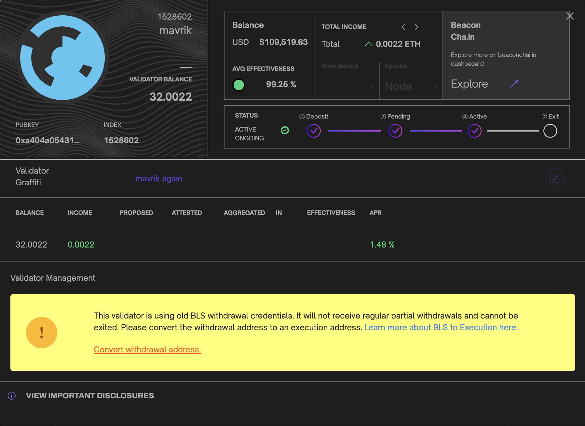
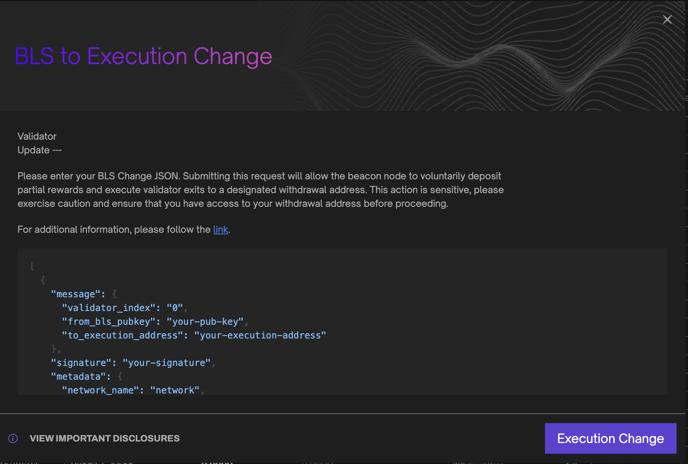
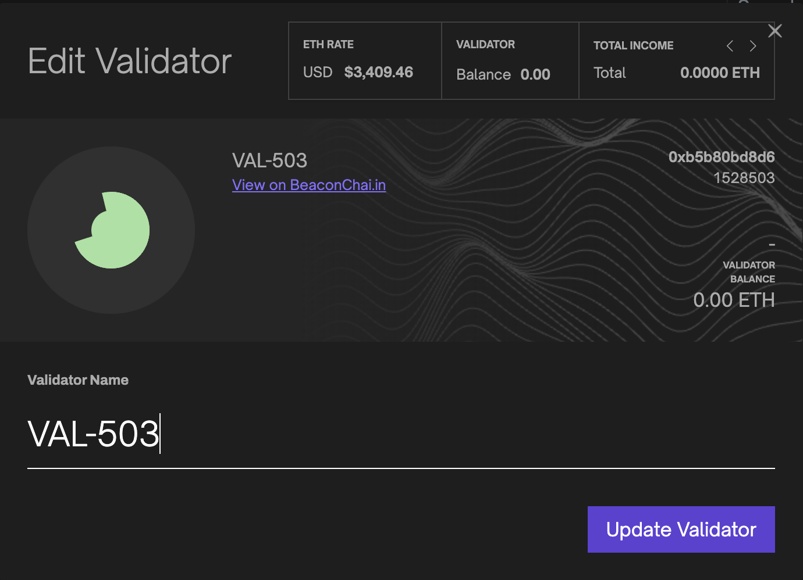
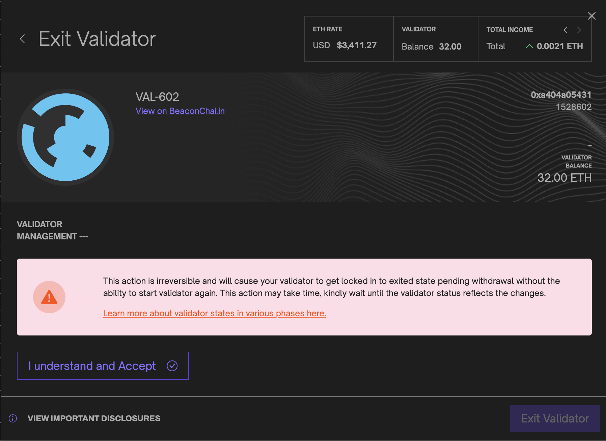

# Usage

Siren offers many features ranging from diagnostics, logs, validator management including graffiti and exiting. Below we will describe all major features and how to take advantage of Siren to the fullest.

## Dashboard

Siren's dashboard view provides a summary of all performance and key validator metrics. Sync statuses, uptimes, accumulated rewards, hardware and network metrics are all consolidated on the dashboard for evaluation.

### Account Earnings

The account earnings component accumulates reward data from all registered validators providing a summation of total rewards earned while staking. Given current conversion rates, this component also converts your balance into your selected fiat currency.

Below in the earning section, you can also view your total earnings or click the adjacent buttons to view your estimated earnings given a specific time frame based on current device and network conditions.

Keep in mind, if validators have updated (`0x01`) withdrawal credentials, this balance will only reflect the balance before the accumulated rewards are paid out and will subsequently be reset to a zero balance and start accumulating rewards until the next reward payout.

### Validator Table

The validator table component is a list of all registered validators, which includes data such as name, index, total balance, earned rewards and current status. Each validator row also contains a link to a detailed data modal and additional data provided by [Beaconcha.in](https://beaconcha.in).

### Validator Balance Chart

The validator balance component is a graphical representation of each validator balance over the latest 10 epochs. Take note that only active validators are rendered in the chart visualization.

By clicking on the chart component you can filter selected validators in the render. This will allow for greater resolution in the rendered visualization.

### Hardware Usage and Device Diagnostics

The hardware usage component gathers information about the device the Beacon Node is currently running. It displays the Disk usage, CPU metrics and memory usage of the Beacon Node device. The device diagnostics component provides the sync status of the execution client and beacon node.

### Log Statistics

The log statistics present an hourly combined rate of critical, warning, and error logs from the validator client and beacon node. This analysis enables informed decision-making, troubleshooting, and proactive maintenance for optimal system performance. You can view the full log outputs in the logs page by clicking `view all` at the top of the component.

________________________________________________________________________________________________________________________________

## Validator Management

Siren's validator management view provides a detailed overview of all validators with options to deposit to and/or add new validators. Each validator table row displays the validator name, index, balance, rewards, status and all available actions per validator.

### Validator Modal

Clicking the validator icon activates a detailed validator modal component. This component also allows users to trigger validator actions and as well to view and update validator graffiti. Each modal contains the validator total income with hourly, daily and weekly earnings estimates.

### Validator BLS Withdrawal Credentials

When Siren detects that your validator is using outdated BLS withdrawal credentials, it will temporarily block any further actions by the validator. You can identify if your validator does not meet this requirement by an `exclamation mark` on the validator icon or a message in the validator modal that provides instructions for updating the credentials.

If you wish to convert your withdrawal address, Siren will prompt you to provide a valid `BLS Change JSON`. This JSON can include a single validator or multiple validators for your convenience. Upon validation, the process will initiate, during which your validator will enter a processing state. Once the process is complete, you will regain access to all other validator actions.

### Validator Edit

Siren makes it possible to edit your validator's display name by clicking the edit icon in the validator table. Note: This does not change the validator name, but gives it an alias you can use to identify each validator easily.
These settings are stored in your browser's `localStorage`  

### Validator Exit

Siren provides the ability to exit/withdraw your validators via the validator management page. In the validator modal, click the validator action `withdraw validator`. Siren will then prompt you with additional information before requiring you to validate your session password. Remember, this action is irreversible and will lock your validator into an exiting state. Please take extra caution.

________________________________________________________________________________________________________________________________

## Validator and Beacon Logs

The logs page provides users with the functionality to access and review recorded logs for both validators and beacons. Users can conveniently observe log severity, messages, timestamps, and any additional data associated with each log entry. The interface allows for seamless switching between validator and beacon log outputs, and incorporates useful features such as built-in text search and the ability to pause log feeds.

Additionally, users can obtain log statistics, which are also available on the main dashboard, thereby facilitating a comprehensive overview of the system's log data. Please note that Siren is limited to storing and displaying only the previous 1000 log messages. This also means the text search is limited to the logs that are currently stored within Siren's limit.

________________________________________________________________________________________________________________________________

## Settings

Siren's settings view provides access to the application theme, version, display name, and important external links. If you experience any problems or have feature request, please follow the github and or discord links to get in touch.

