# Usage

# Dashboard

Siren's dashboard view provides a summary of all performance and key validator metrics. Sync statuses, uptimes, accumulated rewards, hardware and network metrics are all consolidated on the dashboard for evaluation.

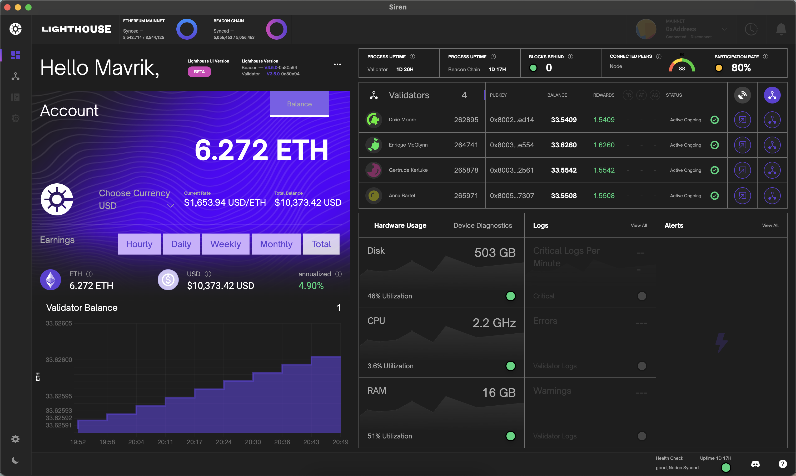

## Account Earnings

The account earnings component accumulates reward data from all registered validators providing a summation of total rewards earned while staking. Given current conversion rates, this component also converts your balance into your selected fiat currency.

Below in the earning section, you can also view your total earnings or click the adjacent buttons to view your estimated earnings given a specific time frame based on current device and network conditions.

## Validator Table

The validator table component is a list of all registered validators, which includes data such as name, index, total balance, earned rewards and current status. Each validator row also contains a link to a detailed data modal and additional data provided by [Beaconcha.in](https://beaconcha.in).

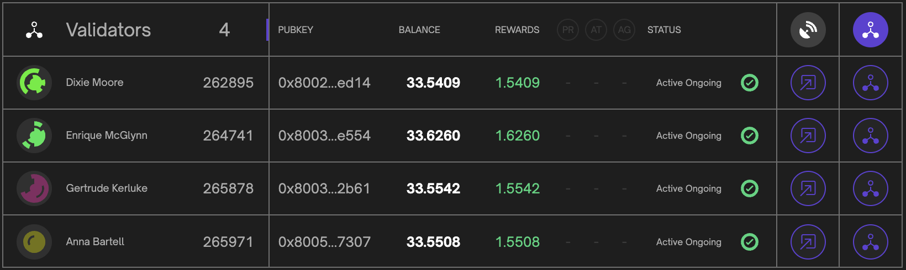

## Validator Balance Chart

The validator balance component is a graphical representation of each validator balance over the latest 10 epochs. Take note that only active validators are rendered in the chart visualization.

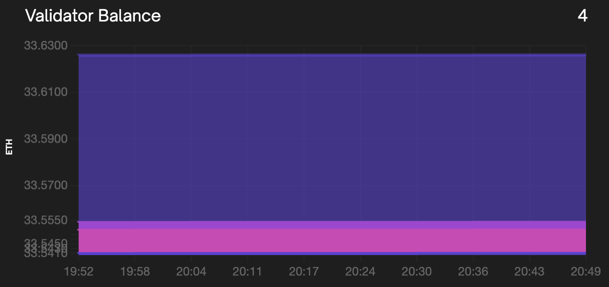

By clicking on the chart component you can filter selected validators in the render. This call allow for greater resolution in the rendered visualization.

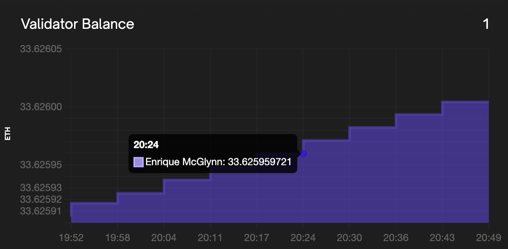

## Hardware Usage and Device Diagnostics

The hardware usage component gathers information about the device the Beacon Node is currently running. It displays the Disk usage, CPU metrics and memory usage of the Beacon Node device. The device diagnostics component provides the sync status of the execution client and beacon node.

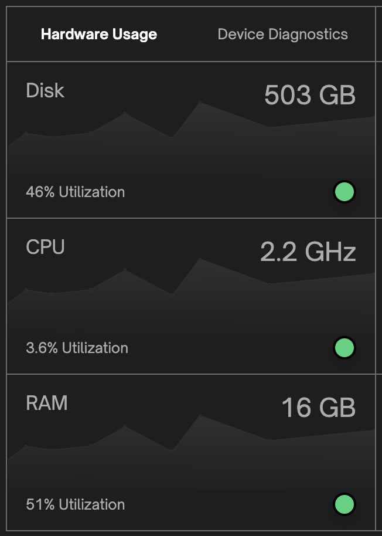

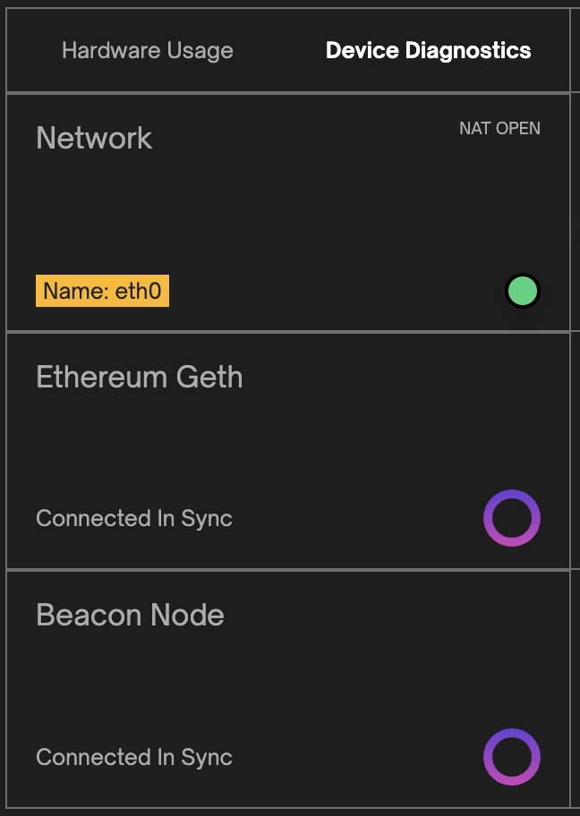

## Log Statistics

The log statistics present an hourly combined rate of critical, warning, and error logs from the validator client and beacon node. This analysis enables informed decision-making, troubleshooting, and proactive maintenance for optimal system performance.

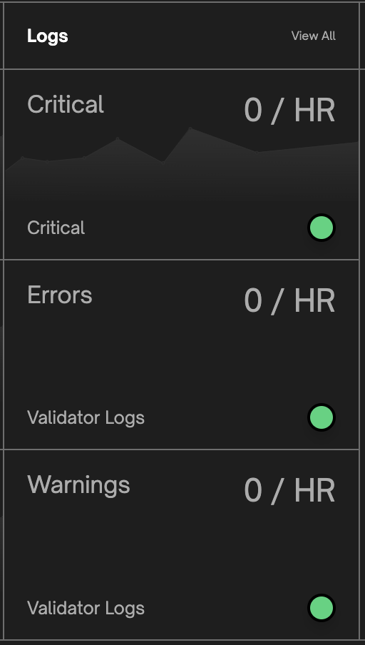

# Validator Management

Siren's validator management view provides a detailed overview of all validators with options to deposit to and/or add new validators. Each validator table row displays the validator name, index, balance, rewards, status and all available actions per validator.

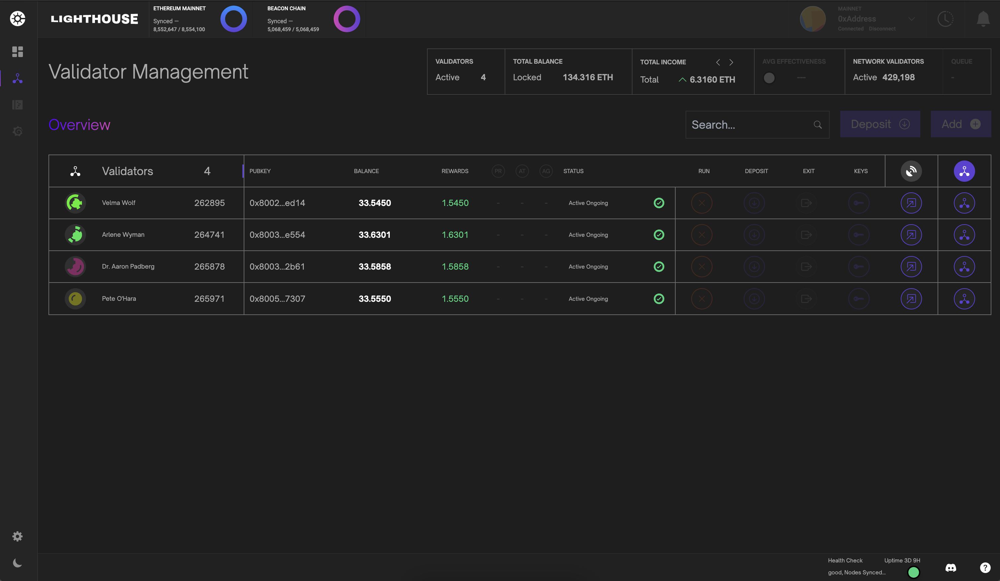

## Validator Modal

Clicking the validator icon activates a detailed validator modal component. This component also allows users to trigger validator actions and as well to view and update validator graffiti. Each modal contains the validator total income with hourly, daily and weekly earnings estimates.

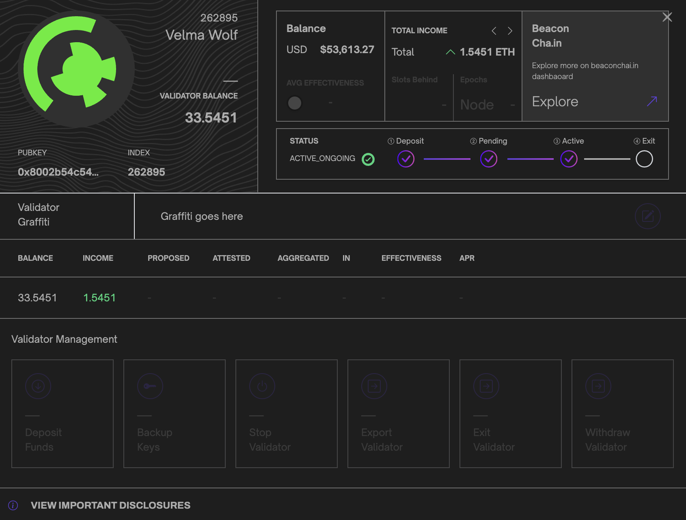

# Settings

Siren's settings view provides access to the application theme, version, name, device name and important external links. From the settings page users can also access the configuration screen to adjust any beacon or validator node parameters.

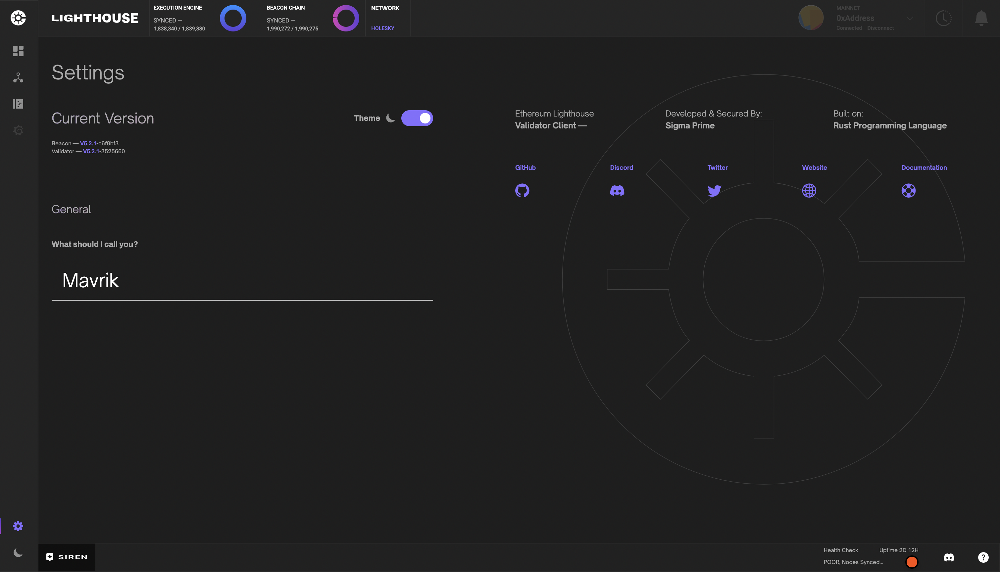

# Validator and Beacon Logs

The logs page provides users with the functionality to access and review recorded logs for both validators and beacons. Users can conveniently observe log severity, messages, timestamps, and any additional data associated with each log entry. The interface allows for seamless switching between validator and beacon log outputs, and incorporates useful features such as built-in text search and the ability to pause log feeds.

Additionally, users can obtain log statistics, which are also available on the main dashboard, thereby facilitating a comprehensive overview of the system's log data. Please note that Siren is limited to storing and displaying only the previous 1000 log messages. This also means the text search is limited to the logs that are currently stored within Siren's limit.

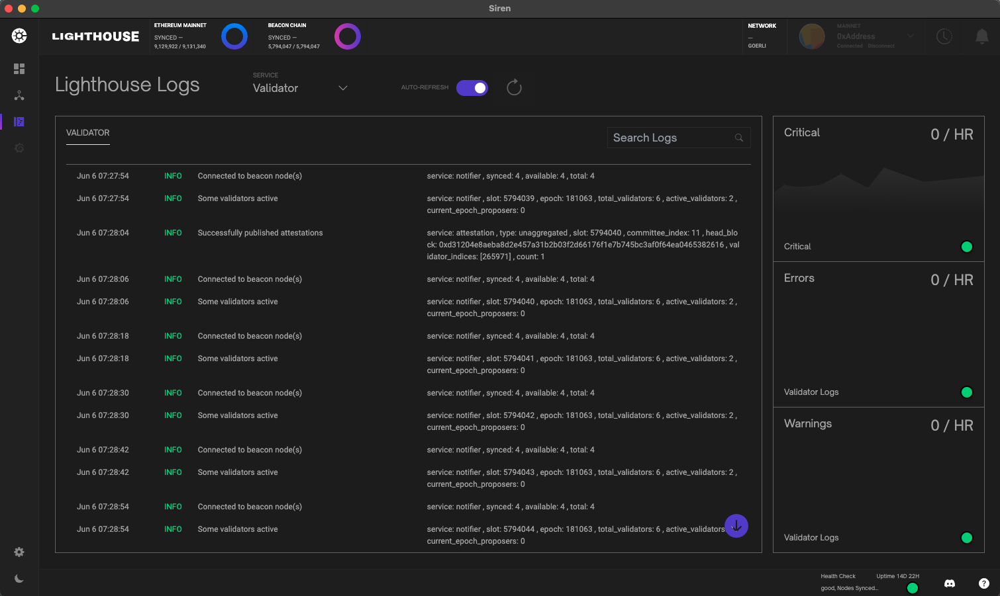