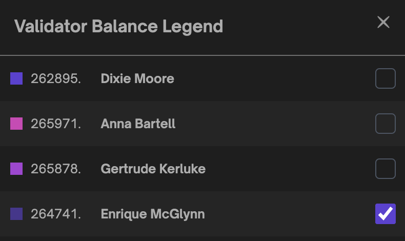

# Usage

## Dashboard

Siren's dashboard provides a summary of all performance and key validator metrics. Sync statuses, uptimes, accumulated rewards, hardware and network metrics and more are all consolidated on the dashboard for evaluation.

## Account Earnings

The account earnings component compiles accumulated rewards data from all registered validators providing a summation of total rewards earned while staking. Given current conversion rates, this component also converts your balance into your selected fiat currency.

Below in the earning section, you also view your total earnings or click the adjacent buttons to view you estimated earnings given a specific timeframe based on current device and network conditions.

## Validator Table

The validator table component is a list of all registered validators, which includes data such as name, index, total balance, earned rewards and current status. Each validator row also contins a link to a detailed data modal and additional data provided by Beacon.cha

## Validator Balance Chart

The validator balance component is a visual graphical representation of each validator balance over the latest 10 epochs. Take note that only active validators are rendered in the chart visualization.

By clicking on the chart component you can filter selected validators in the render. This will allow for greater detail in the rendered visualization

## Hardware Usage and Device Diagnostics

The hardware usage component gathers information about the device the Beacon Node is currently running. It displays the Disk Space, CPU frequency and RAM allocations of the Beacon Node device. The device diagnostics component provided the sync status of the execution client and beacon node.

