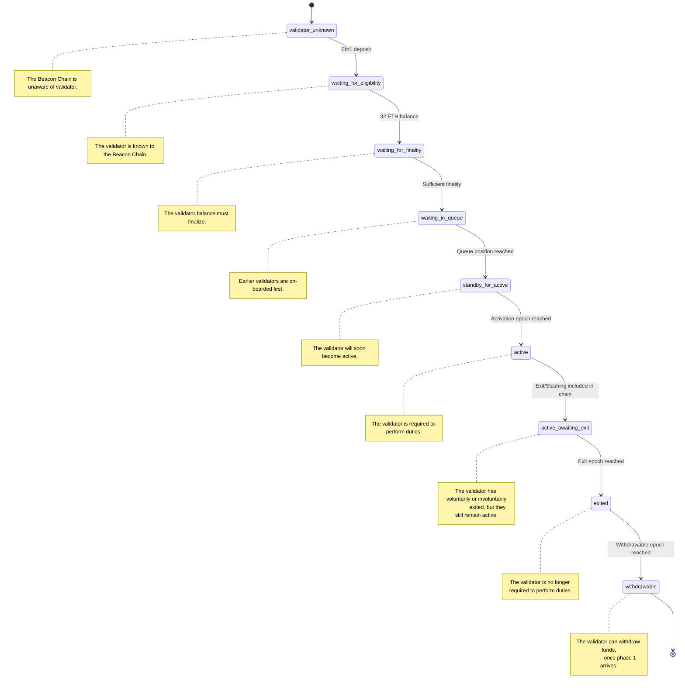

# Validator Life-Cycle

From the perspective of the Beacon Chain, each validator progresses through a
linear life-cycle. Each validator follows the same *order* of steps, but the
*timing* between each step can (and usually will) vary.

This document seeks to enumerate the possible states for a validator, describe
the properties of each state and describe the actions which cause transitions
between those states.

## Table of Contents

<!-- toc -->

## State Diagram

There are 9 states in total, represented in the state diagram below. Each state
is represented by an outlined, rounded rectangle (e.g., `validator_unknown` is
the first state).

A state change is triggered by some event on the beacon chain; either the
inclusion of an object in a block (e.g., a deposit or slashing) or during the
`process_registry_updates` routine that is performed once per epoch.

## States in Detail

### 1. `validator_unknown`

The Beacon Chain is completely unaware of the validator. This might be because
the validator:

- has never deposited.
- has submitted a deposit transaction, but it has not yet been included in the
	beacon chain.

**Progression**

The validator can progress past this phase once the Beacon Chain has processed
the `Deposit` message from the Eth1 deposit contract.

**Progression requires user input?**

User input is required to submit the deposit and have it included in the eth1 chain. After that, it is up to the beacon chain.

### 2. `waiting_for_eligibility`

A `Deposit` is included in a `BeaconBlock`, causing the Beacon Chain to become
aware of the validator.

**Progression**

The validator can progress past this phase when:

- They have deposited at least 32 ETH.
- The beacon chain has transitioned into the next epoch after the validators
	`Deposit` was included in a block (no more than 6.4 minutes).

**Progression requires user input?**

User input is required to submit 32 ETH (or more) in deposits and have those
included in the beacon chain. After that, it is up to the beacon chain.

### 3. `waiting_for_finality`

The Beacon Chain has observed that the validator *could* become eligible and it
is waiting for those conditions to become finalized.

**Progression**

The validator can progress past this phase when the Beacon Chain finalizes the
epoch *following* the one where they became eligible for activation. E.g., if
the validator became eligible in epoch 2, we must wait for epoch 3 to
finalize.

**Progression requires user input?**

No.

### 4. `waiting_in_queue`

The conditions which allow the validator to become active are finalized. The
validator is now waiting in the activation queue, awaiting its turn to be
activated.

**Progression**

The validator can progress past this phase once all validators earlier in the
queue have been activated.

**Progression requires user input?**

No.

### 5. `standby_for_active`

The conditions which allow the validator to become active are finalized. The
validator is now waiting in the activation queue, awaiting its turn to be
activated.

**Progression**

The validator must wait for the `activation_epoch` that was determined at the
beginning of this period.

**Progression requires user input?**

No.

### 6. `active`

The validator is now active and required to publish attestations and
potentially produce blocks.

**Progression**

The validator can progress past this phase for two reasons:

- The validator submits a signed `VoluntaryExit` message (i.e., they choose to
	exit).
- The validator is slashed.

**Progression requires user input?**

Yes, the user may choose to submit a `VoluntaryExit` to start the exit. Or, the
validator must sign two conflicting messages and then have those messages
submitted in a `ProposerSlashing` or `AttesterSlashing`.

### 7. `active_awaiting_exit`

The validator has either voluntarily or involuntarily started exiting. It is
still active, but it will soon lose that status.

**Progression**

The validator must wait until the exit epoch arrives. This exit epoch was
decided by the protocol when the exit was initiated.

**Progression requires user input?**

No.

### 8. `exited`

The validator has exited and is no longer required (or permitted) to publish
messages for inclusion in the Beacon Chain.

**Progression**

The validator must wait until the withdrawable epoch arrives. This withdrawable epoch was
decided by the protocol when the exit was initiated.

**Progression requires user input?**

No.

### 9. `withdrawable`

The validator has exited and waited long enough to be withdrawable.

From the perspective of the Beacon Chain, this is the end of the road for a
validator.
