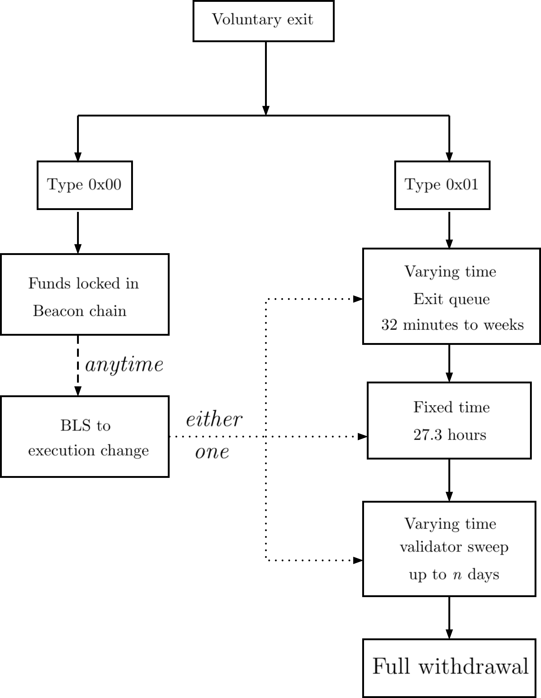

# Voluntary Exits (Full Withdrawals)

A validator may chose to voluntarily stop performing duties (proposing blocks and attesting to blocks) by submitting
a voluntary exit message to the beacon chain.

A validator can initiate a voluntary exit provided that the validator is currently active, has not been slashed and has been active for at least 256 epochs (~27 hours) since it has been activated.

> Note: After initiating a voluntary exit, the validator will have to keep performing duties until it has successfully exited to avoid penalties.

It takes at a minimum 5 epochs (32 minutes) for a validator to exit after initiating a voluntary exit.
This number can be much higher depending on how many other validators are queued to exit.

## Initiating a voluntary exit

In order to initiate an exit, users can use the `lighthouse account validator exit` command.

- The `--keystore` flag is used to specify the path to the EIP-2335 voting keystore for the validator. The path should point directly to the validator key `.json` file, _not_ the folder containing the `.json` file.

- The `--beacon-node` flag is used to specify a beacon chain HTTP endpoint that confirms to the [Beacon Node API](https://ethereum.github.io/beacon-APIs/) specifications. That beacon node will be used to validate and propagate the voluntary exit. The default value for this flag is `http://localhost:5052`.

- The `--network` flag is used to specify the network (default is `mainnet`).

- The `--password-file` flag is used to specify the path to the file containing the password for the voting keystore. If this flag is not provided, the user will be prompted to enter the password.


After validating the password, the user will be prompted to enter a special exit phrase as a final confirmation after which the voluntary exit will be published to the beacon chain.

The exit phrase is the following:
> Exit my validator


Below is an example for initiating a voluntary exit on the Goerli testnet.

```
$ lighthouse --network goerli account validator exit --keystore /path/to/keystore --beacon-node http://localhost:5052

Running account manager for Prater network
validator-dir path: ~/.lighthouse/goerli/validators

Enter the keystore password for validator in 0xabcd

Password is correct

Publishing a voluntary exit for validator 0xabcd

WARNING: WARNING: THIS IS AN IRREVERSIBLE OPERATION


PLEASE VISIT https://lighthouse-book.sigmaprime.io/voluntary-exit.html
TO MAKE SURE YOU UNDERSTAND THE IMPLICATIONS OF A VOLUNTARY EXIT.

Enter the exit phrase from the above URL to confirm the voluntary exit:
Exit my validator

Successfully published voluntary exit for validator 0xabcd
Voluntary exit has been accepted into the beacon chain, but not yet finalized. Finalization may take several minutes or longer. Before finalization there is a low probability that the exit may be reverted.
Current epoch: 29946, Exit epoch: 29951, Withdrawable epoch: 30207
Please keep your validator running till exit epoch
Exit epoch in approximately 1920 secs
```

## Full withdrawal of staked fund

After the [Capella](https://ethereum.org/en/history/#capella) upgrade on 12<sup>th</sup> April 2023, if a user initiates a voluntary exit, they will receive the full staked funds to the withdrawal address, provided that the validator has withdrawal credentials of type `0x01`. For more information on how fund withdrawal works, please visit [Ethereum.org](https://ethereum.org/en/staking/withdrawals/#how-do-withdrawals-work) website.

## FAQ

### 1. How to know if I have the withdrawal credentials type `0x01`?

There are two types of withdrawal credentials, `0x00` and `0x01`. To check which type your validator has, go to [Staking launchpad](https://launchpad.ethereum.org/en/withdrawals), enter your validator index and click `verify on mainnet`:

 - `withdrawals enabled` means your validator is of type `0x01`, and you will automatically receive the full withdrawal to the withdrawal address that you set.
- `withdrawals not enabled` means your validator is of type `0x00`, and will need to update your withdrawal credentials from `0x00` type to `0x01` type (also known as BLS-to-execution-change, or BTEC) to receive the staked funds. The common way to do this is using `Staking deposit CLI` or `ethdo`, with the instructions available [here](https://launchpad.ethereum.org/en/withdrawals#update-your-keys). 


### 2. What if my validator is of type `0x00` and I do not update my withdrawal credentials after I initiated a voluntary exit?

   Your staked fund will continue to be locked on the beacon chain. You can update your withdrawal credentials **anytime**, and there is no deadline for that. The catch is that as long as you do not update your withdrawal credentials, your staked funds in the beacon chain will continue to be locked in the beacon chain. Only after you update the withdrawal credentials, will the staked funds be withdrawn to the withdrawal address.

### 3. How many times can I update my withdrawal credentials? 
    
   If your withdrawal credentials is of type `0x00`, you can only update it once to type `0x01`. It is therefore very important to ensure that the withdrawal address you set is an address under your control, preferably an address controlled by a hardware wallet.

   If your withdrawal credentials is of type `0x01`, it means you have set your withdrawal address previously, and you will not be able to change the withdrawal address.

### 3. When will my BTEC request (update withdrawal credentials to type `0x01`) be processed ?
  
   Your BTEC request will be included very quickly as soon as a new block is proposed. This should be the case most (if not all) of the time, given that the peak BTEC request time has now past (right after the [Capella](https://ethereum.org/en/history/#capella) upgrade on 12<sup>th</sup> April 2023 and lasted for ~ 2 days) .

### 4. When will I get my staked fund after voluntary exit if my validator is of type `0x01`? 
   
   There are 3 waiting periods until you get the staked funds in your withdrawal address:

   - An exit queue: a varying time that takes at a minimum 5 epochs (32 minutes) if there is no queue; or if there are many validators exiting at the same time, it has to go through the exit queue. The exit queue can be from hours to weeks, depending on the number of validators in the exit queue. During this time your validator has to stay online to perform its duties to avoid penalties.
   
   - A fixed waiting period of 256 epochs (27.3 hours) for the validator's status to become withdrawable.

   - A varying time of "validator sweep" that can take up to 5 days (at the time of writing with ~560,000 validators on the mainnet). The "validator sweep" is the process of skimming through all validators by index number for eligible withdrawals (those with type `0x01` and balance above 32ETH). Once the "validator sweep" reaches your validator's index, your staked fund will be fully withdrawn to the withdrawal address set. 

   The total time taken is the summation of the above 3 waiting periods. After these waiting periods, you will receive the staked funds in your withdrawal address.

The voluntary exit and full withdrawal process is summarized in the Figure below.



